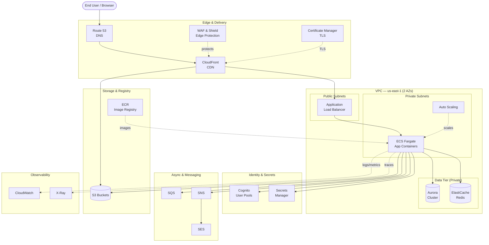
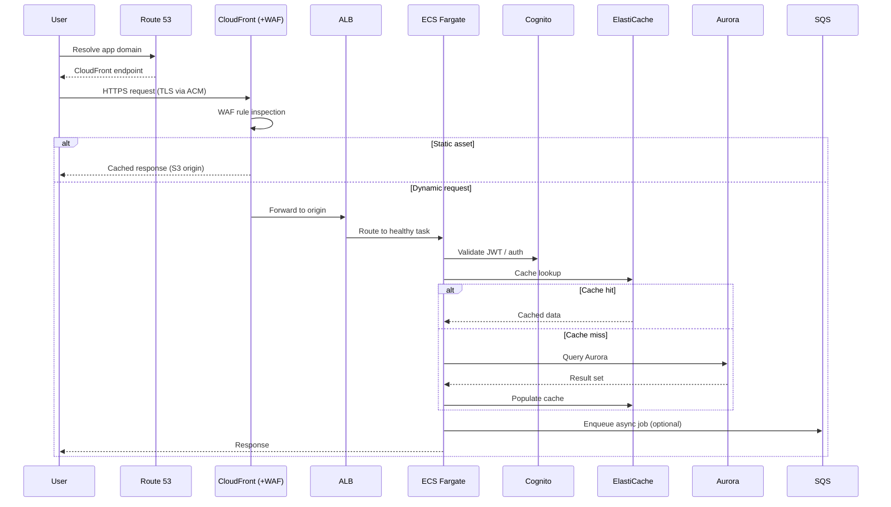
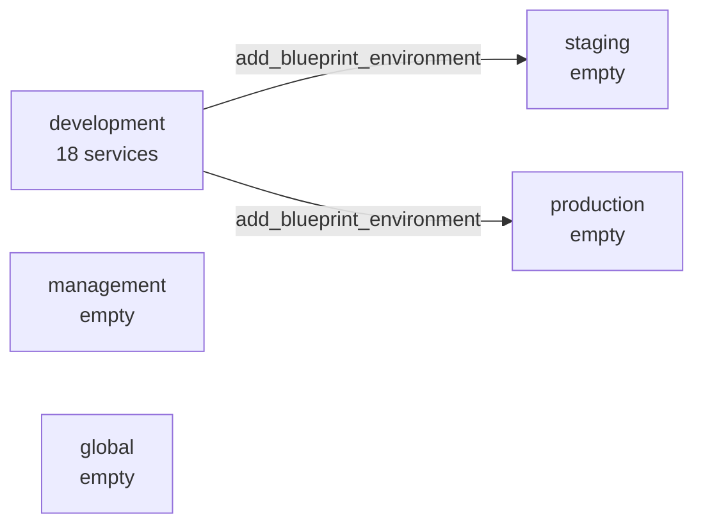

# AWS SaaS Platform — `getcash-saas`

**Blueprint ID:** `tpl_f41a4972a1e4`
**Provider:** AWS · **Category:** Web Application · **Tier:** Premium
**Region:** us-east-1 (N. Virginia) · **Environment:** Development
**Projected Monthly Cost:** ~$450.00 USD
**Author:** CloudGods.io · **Generated:** 2026-07-01

---

## 1. Executive Summary

`getcash-saas` is a public, internet-facing SaaS platform built on a cloud-native, container-based AWS architecture. It runs application workloads on **ECS Fargate** behind an **Application Load Balancer**, fronted by **CloudFront** and **Route 53** for global edge delivery and DNS. Persistent state lives in **Amazon Aurora**, with **ElastiCache** providing a low-latency caching tier. User identity is handled by **Amazon Cognito**, and the public edge is protected by **AWS WAF & Shield**.

The design targets **99.9% availability** with a **balanced** cost posture and an **auto-scaling** capacity model. It is deployed as a single-region (us-east-1) development environment, structured so staging and production namespaces can be cloned from the same blueprint.

---

## 2. Requirements & Design Drivers

| Requirement | Value | Architectural Impact |
|-------------|-------|----------------------|
| Business use case | Public SaaS platform | Internet-facing edge, multi-tenant identity, elastic compute |
| Availability target | 99.9% (~8.7h/yr) | Multi-AZ deployment across 2 Availability Zones |
| Latency sensitivity | Medium | CDN edge caching + in-memory cache tier |
| Cost posture | Balanced | Fargate (no idle EC2), managed services, right-sized DR |
| Compliance | None | Standard security baseline, no regulated controls |
| Scalability model | Auto-scaling | ECS Service Auto Scaling + Application Auto Scaling policies |
| Data classification | Public | Encryption in transit; standard storage controls |
| Disaster recovery | None (single region) | No cross-region standby; backups within region |

---

## 3. Architecture Overview

---

## 4. Request & Data Flow

---

## 5. Service Layers

### 5.1 Networking & Delivery

| Service | Role | Notes |
|---------|------|-------|
| **Amazon VPC** | Network isolation boundary | 2 AZs; public subnets (ALB), private subnets (ECS, data); 2 NAT Gateways for egress |
| **Route 53** | Authoritative DNS | Hosted zone, health checks, alias records to CloudFront |
| **CloudFront** | CDN / edge | Caches static assets from S3, terminates TLS, forwards dynamic traffic to ALB |

The VPC is the foundation: the Application Load Balancer sits in public subnets while all compute and data resources live in private subnets, reachable only through the ALB or NAT-based egress.

### 5.2 Compute

| Service | Role | Notes |
|---------|------|-------|
| **Amazon ECS (Fargate)** | Container runtime | Runs application tasks with no server management |
| **Auto Scaling** | Elastic capacity | Target-tracking policies on CPU/memory/request count |

ECS Fargate removes instance patching and capacity planning. Service Auto Scaling adjusts task count to demand, supporting the balanced cost posture by scaling in during low traffic.

### 5.3 Data

| Service | Role | Notes |
|---------|------|-------|
| **Amazon Aurora** | Primary relational store | Multi-AZ; managed backups; auto-scaling storage |
| **Amazon ElastiCache** | In-memory cache | Session and hot-query caching to reduce Aurora load and latency |

### 5.4 Storage & Registry

| Service | Role | Notes |
|---------|------|-------|
| **Amazon S3** | Object storage | Static assets (CloudFront origin), uploads, backups, logs |
| **Amazon ECR** | Container registry | Stores versioned application images consumed by ECS |

### 5.5 Security & Identity

| Service | Role | Notes |
|---------|------|-------|
| **Amazon Cognito** | User identity | Sign-up/sign-in, JWT tokens, tenant auth |
| **Secrets Manager** | Secret storage | DB credentials, API keys, automatic rotation |
| **Certificate Manager** | TLS certificates | Free managed certs for CloudFront/ALB |
| **WAF & Shield** | Edge protection | OWASP-style rule protection + DDoS mitigation |

### 5.6 Integration & Messaging

| Service | Role | Notes |
|---------|------|-------|
| **SQS** | Async queue | Decouples background work; buffers traffic spikes |
| **SNS** | Pub/sub | Event fan-out and alerting |
| **SES** | Email | Transactional email (signup, reset, notifications) |

### 5.7 Observability

| Service | Role | Notes |
|---------|------|-------|
| **CloudWatch** | Metrics, logs, alarms | Drives auto-scaling and 99.9% uptime alerting |
| **X-Ray** | Distributed tracing | End-to-end latency tracing across ECS → Aurora |

---

## 6. Security Posture

Security is layered from the edge inward. **WAF & Shield** inspect and filter traffic before it reaches the origin, **Certificate Manager** enforces TLS in transit, and **Cognito** authenticates every user request. Application secrets are never hard-coded — they are retrieved at runtime from **Secrets Manager**. All compute and data resources run in private subnets with no direct inbound internet access; the only public entry points are CloudFront and the ALB. Observability via **CloudWatch** and **X-Ray** provides the audit and diagnostic trail.

Because the data classification is **Public** and there are no formal compliance frameworks, the design uses the standard AWS security baseline rather than regulated controls such as dedicated KMS customer-managed keys, GuardDuty, or Security Hub. These can be layered in later if requirements change.

---

## 7. Availability & Disaster Recovery

The **99.9%** target is met by spreading the ALB, ECS tasks, Aurora, and ElastiCache across **two Availability Zones** within us-east-1. If one AZ degrades, the load balancer routes to healthy tasks in the other AZ and Aurora fails over to a standby replica.

Disaster recovery is scoped to **None (single region)** — there is no cross-region standby. Resilience is therefore in-region only, relying on multi-AZ redundancy and Aurora's automated backups. If future requirements call for regional failure protection, the blueprint can be extended toward a backup-only, pilot-light, or warm-standby posture in a second region.

---

## 8. Cost Considerations

The projected **~$450/month** reflects the development environment. Primary cost drivers are the two NAT Gateways, the Aurora cluster, and Fargate task-hours. The balanced posture keeps costs down by using Fargate (no idle EC2 fleet), scaling tasks in during off-peak hours, and relying on ElastiCache to reduce database load. Static delivery through CloudFront + S3 is inexpensive relative to serving the same assets from compute.

Cost levers if optimization is needed: consolidate to a single NAT Gateway (dev only), use Aurora Serverless for spiky dev workloads, and apply aggressive scale-in policies.

---

## 9. Resource Inventory

| Resource | Count |
|----------|-------|
| VPCs | 1 |
| Availability Zones | 2 |
| NAT Gateways | 2 |
| Application Load Balancers | 1 |
| ECS Fargate Services | 1 |
| Aurora Clusters | 1 |
| ElastiCache Clusters | 1 |
| S3 Buckets | 2 |
| CloudFront Distributions | 1 |
| Route 53 Hosted Zones | 1 |
| Cognito User Pools | 1 |
| WAF Web ACLs | 1 |
| SQS Queues | 2 |
| SNS Topics | 1 |
| ECR Repositories | 1 |

**Total blueprint services:** 18 (development namespace)

---

## 10. Deployment Model

The blueprint is provisioned through Terraform modules and implementation repositories per service (module repos under `terraform-aws-module-ai`, implementations under `terraform-aws-impl-ai`), orchestrated by CI/CD roots under `terraform-aws-cicd-pra`. All 18 services are defined in the **development** namespace; the **staging**, **production**, **management**, and **global** namespaces are present but empty, ready to be populated by cloning development.

---

## 11. Next Steps

1. **Add environments** — clone development into staging/production via `add_blueprint_environment` for a full dev → staging → prod pipeline.
2. **Provision infrastructure** — deploy via the CloudGods Delivery Engine.
3. **Harden for production** — before going live, consider adding KMS customer-managed keys, GuardDuty, and a second-region DR posture if requirements evolve.

---

*Documentation generated for blueprint `tpl_f41a4972a1e4` using the system-design-documentation workflow.*

